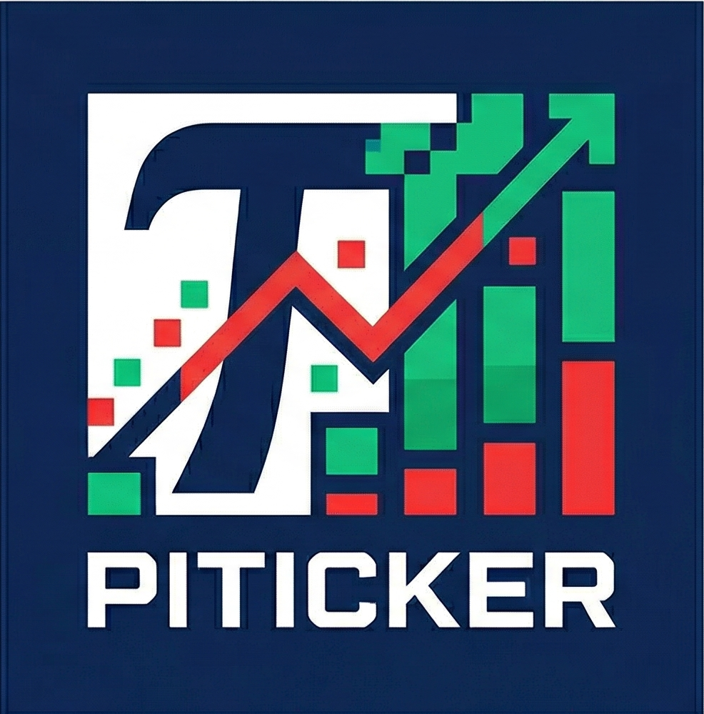
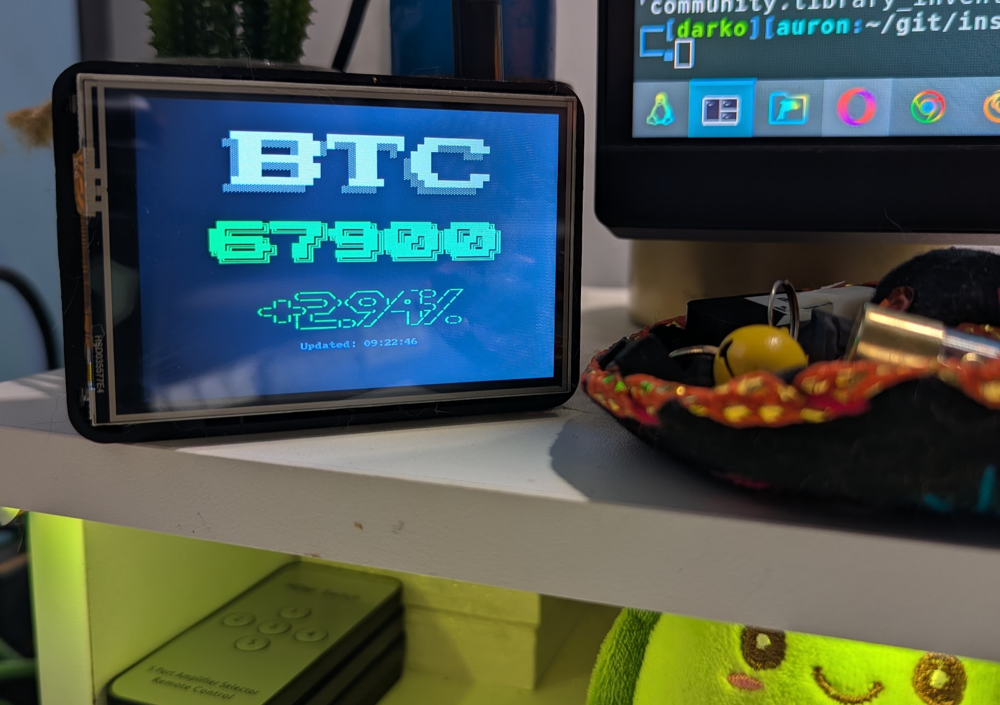
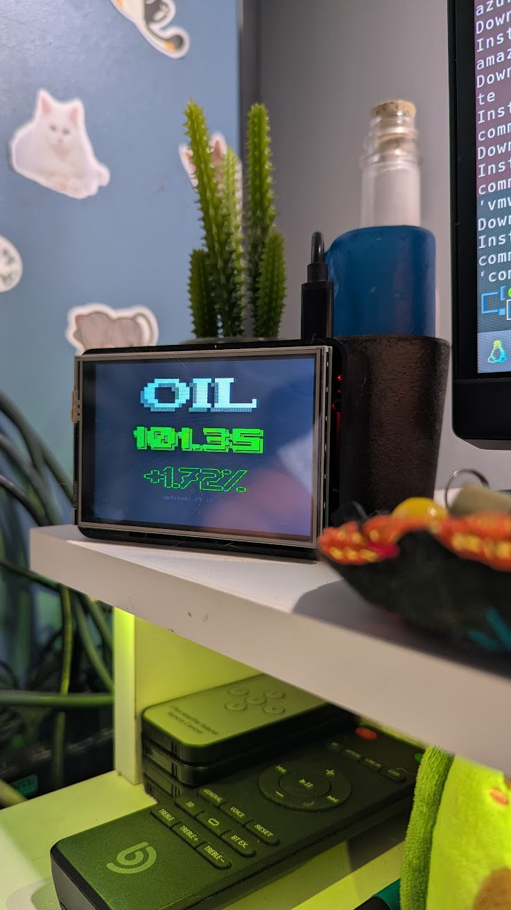
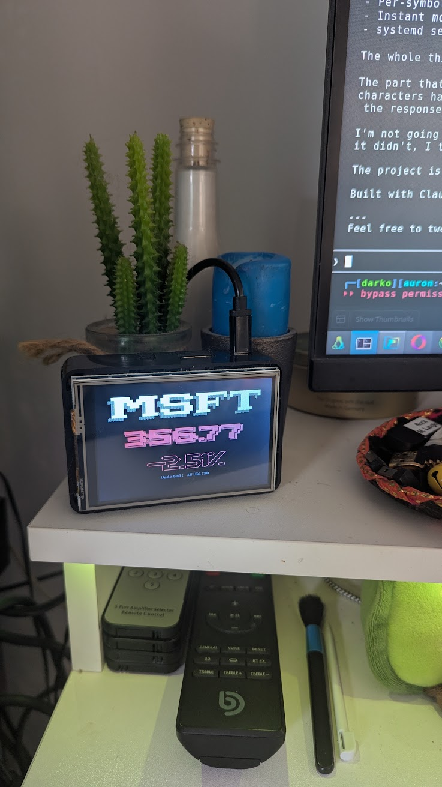
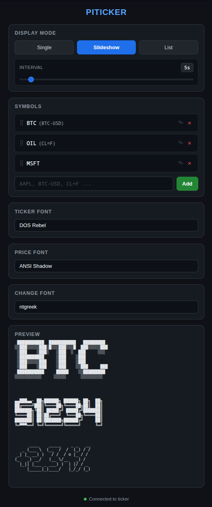
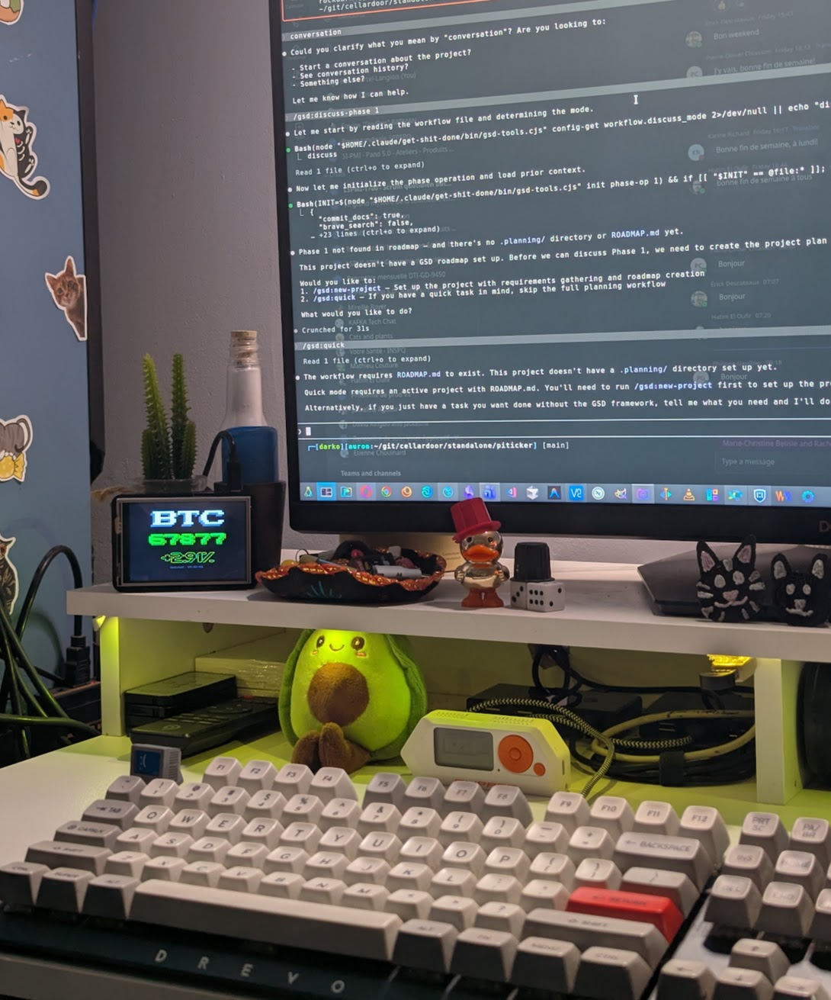

<p align="center">
  
</p>

# PiTicker

Fullscreen stock and crypto price display for Raspberry Pi with GPIO touchscreen. Prices render as large ASCII art using [figlet](http://www.figlet.org/) fonts, color-coded green/red for up/down. Control everything from your phone via the built-in web UI.

<p align="center">
  
</p>

## TL;DR

A Raspberry Pi + a cheap GPIO screen = a desk ticker that shows live prices for stocks, crypto, forex, and commodities. Controlled from your phone. No coding required.

```bash
git clone https://github.com/rockdarko/piticker.git
cd piticker
sudo ./install.sh    # interactive — asks a few questions, handles everything
```

Open `http://<pi-ip>:8080/` to control it. Done.

**What it does:** Big ASCII art prices on a small screen. Three modes (single, slideshow, list). 300+ fonts. Custom display names. Per-symbol cents control. Drag to reorder. Instant mode switching. All from a web UI on your phone.

**What it needs:** Raspberry Pi, GPIO display, network connection.

## Data Source

Prices come from the [Yahoo Finance](https://finance.yahoo.com/) chart API. Look up any symbol on Yahoo Finance — if it has a page there, PiTicker can display it.

To find the right ticker symbol, search on [finance.yahoo.com](https://finance.yahoo.com/) and use the symbol exactly as shown:

| Type | How to find it | Examples |
|------|---------------|----------|
| Stocks | Search company name, use the ticker | `AAPL`, `MSFT`, `NVDA` |
| Crypto | Search coin name, use the `-USD` pair | `BTC-USD`, `ETH-USD`, `SOL-USD` |
| Indices | Search index name, starts with `^` | `^GSPC` (S&P 500), `^DJI` (Dow) |
| Forex | Search currency pair, ends with `=X` | `EURUSD=X`, `GBPUSD=X` |
| Commodities | Search commodity, ends with `=F` | `CL=F` (Oil), `GC=F` (Gold), `SI=F` (Silver) |

Some symbols look unfriendly on a display (e.g., `CL=F` for oil). PiTicker lets you set a **display name** per symbol — show "Oil" on the screen while fetching data with `CL=F` under the hood. The real ticker is always visible in the web UI so you know what's what.

<p align="center">
  
</p>

You can also toggle **cents display** per symbol: some prices (like BTC at $87,000) don't need cents, while others (like a $3.42 forex rate) do. Set each to Auto (drops cents over $1,000), Show (always), or Hide (never).

## Display Modes

### Single

One symbol fills the entire screen. The ticker name renders at the top, the price dominates the center in large ASCII art, and the percent change sits below. Colors flip green or red based on the day's movement.

Best for keeping an eye on one thing — BTC on your desk, your main holding on the shelf.

### Slideshow

Cycles through a list of symbols one at a time, each displayed fullscreen like single mode. The rotation interval is adjustable from 2 to 60 seconds via a slider in the web UI.

Best for watching a portfolio — set your symbols, set your pace, let it rotate.

<p align="center">
  
</p>

> Single and slideshow use the same fullscreen layout — slideshow just rotates through your symbols automatically.

### List

All symbols displayed simultaneously in a color-coded table with columns for symbol, price, change, and percent. Each row is independently colored green/red. Prices are fetched in parallel for fast updates.

Best for a quick dashboard view of everything at once.

> **Note:** List mode currently uses plain console text, which is barely readable on a 3.5" GPIO display. Planning to convert it to figlet rendering once I find a compact font that works well in a table layout.

## Features

### Web Control Panel
Control everything from your phone or laptop — no SSH needed. Dark-themed, mobile-friendly UI served directly from the Pi.

<p align="center">
  
</p>

- **Mode switching** — tap Single, Slideshow, or List to change instantly
- **Symbol management** — add, remove, and drag-to-reorder symbols
- **Display names** — rename any symbol for the display (e.g., "CL=F" → "Oil", "BTC-USD" → "BTC"). The real ticker is always visible alongside the alias
- **Cents control** — per-symbol option to always show cents, always hide them, or let the display auto-decide based on screen space
- **Font preview** — browse 300+ figlet fonts with a live ASCII art preview of all three font slots before applying. One-click Apply sends changes to the display
- **Slideshow interval** — drag a slider to set rotation speed (2-60 seconds)

### Instant Response
Mode changes, symbol additions, font switches — everything takes effect within a second. The display uses `inotifywait` to watch for state file changes and reacts immediately instead of waiting for a polling interval.

### Smart Font Rendering
Prices render in large ASCII art using three independent font slots:
- **Ticker font** — the symbol name (e.g., BTC)
- **Price font** — the big price number (e.g., $42,567)
- **Change font** — the percent change (e.g., +2.34%)

The display auto-fits: if your chosen font is too wide for the screen, it tries the text without cents first, then gracefully falls back to progressively smaller fonts. You can also force cents on or off per symbol to control what gets displayed.

### Per-Symbol Settings
Each symbol can have its own:
- **Display name** — custom label for the screen (raw ticker always visible in the web UI)
- **Cents preference** — Auto (drops cents for prices over $1,000), Show (always), or Hide (never)

Settings persist across reboots and mode changes.

## Hardware

<p align="center">
  
</p>

**Raspberry Pi** — any model with GPIO header (tested on Pi 3B+)

**GPIO Display** — 3.5" TFT touchscreen, plugs directly into the GPIO pins:
- [Kuman 3.5" TFT LCD (Amazon)](https://www.amazon.ca/dp/B0BJDTL9J3)
- Any goodtft-compatible 3.5" GPIO display should work

**Display driver setup** — use the [goodtft/LCD-show](https://github.com/goodtft/LCD-show) scripts:
```bash
git clone https://github.com/goodtft/LCD-show.git
cd LCD-show
sudo ./LCD35-show    # for 3.5" screens — reboots the Pi
```
To switch back to HDMI: `sudo ./LCD-hdmi`

## Install

```bash
git clone https://github.com/rockdarko/piticker.git
cd piticker
sudo ./install.sh
```

The interactive installer will:
1. Check for GPIO display configuration (links to LCD-show if not found)
2. Offer to rotate the screen 180° (for upside-down mounted screens)
3. Ask for install path, initial symbols, web UI port, and display TTY
4. Install dependencies (figlet, toilet, jq, curl, socat, inotify-tools)
5. Set up systemd services that start on boot
6. Start the display and control server

After install, open `http://<pi-ip>:8080/` from any device on the network.

## Fonts

PiTicker uses [figlet](http://www.figlet.org/) to render prices as large ASCII art. The installer pulls in both `figlet` and `toilet` which together provide 300+ fonts.

The web UI lets you preview any font before applying — select a font from any of the three dropdowns and the preview panel shows all three slots rendered together, exactly as they'll appear on the display.

Some fonts that work well on small GPIO screens:

| Font | Style |
|------|-------|
| `Banner` | Classic block letters |
| `Colossal` | Very large, bold |
| `big` | Clean and wide |
| `ANSI Shadow` | Shadow effect with box-drawing |
| `DOS Rebel` | Retro DOS style |
| `Doom` | Bold and chunky |
| `Electronic` | Digital/LED look |

## Managing

```bash
# Start / stop / restart the display
sudo systemctl start piticker
sudo systemctl stop piticker
sudo systemctl restart piticker

# Start / stop the control server
sudo systemctl start piticker-ctl
sudo systemctl stop piticker-ctl

# View logs
journalctl -u piticker -f
```

Everything can also be controlled via HTTP — no SSH needed:

```bash
# Switch symbol (keeps your list, just focuses this one)
curl http://pi:8080/set/ETH-USD

# Switch to slideshow with multiple symbols
curl http://pi:8080/slideshow/BTC-USD,ETH-USD,AAPL

# Switch to list view
curl http://pi:8080/list/BTC-USD,ETH-USD,AAPL

# Add / remove from current list
curl http://pi:8080/add/NVDA
curl http://pi:8080/remove/AAPL

# Set display name
curl http://pi:8080/alias/set/CL%3DF/Oil

# Set cents preference
curl http://pi:8080/cents/set/BTC-USD/no

# Change font
curl http://pi:8080/font/ANSI%20Shadow
```

## Uninstall

```bash
sudo ./uninstall.sh
```

Removes services, files, and state. Does not change screen rotation settings.

## How this was built

This project was vibe coded from start to finish. I'm not a developer — I'm an SRE who lives in terminals, writes Bash and Ansible in my sleep, and spends my days wrangling metrics and keeping systems alive. I had the idea for a desk ticker, knew exactly how I wanted it to work, and paired with AI to build it.

The entire project — every feature, every bug fix, every UI decision — was built in a single session using [Claude Code](https://claude.ai/claude-code) with the [Get Shit Done (GSD)](https://github.com/gsd-build/get-shit-done) workflow framework. GSD handled the planning, phasing, execution, and verification while I drove the product decisions.

**Models used:** Claude Opus 4.6 (orchestration), Claude Sonnet 4.6 (planning, research, execution agents)

The result: ~2,200 lines of pure Bash and vanilla JS, zero frameworks, zero build tools — just the kind of clean, dependency-light stack an SRE can appreciate.

## License

MIT
